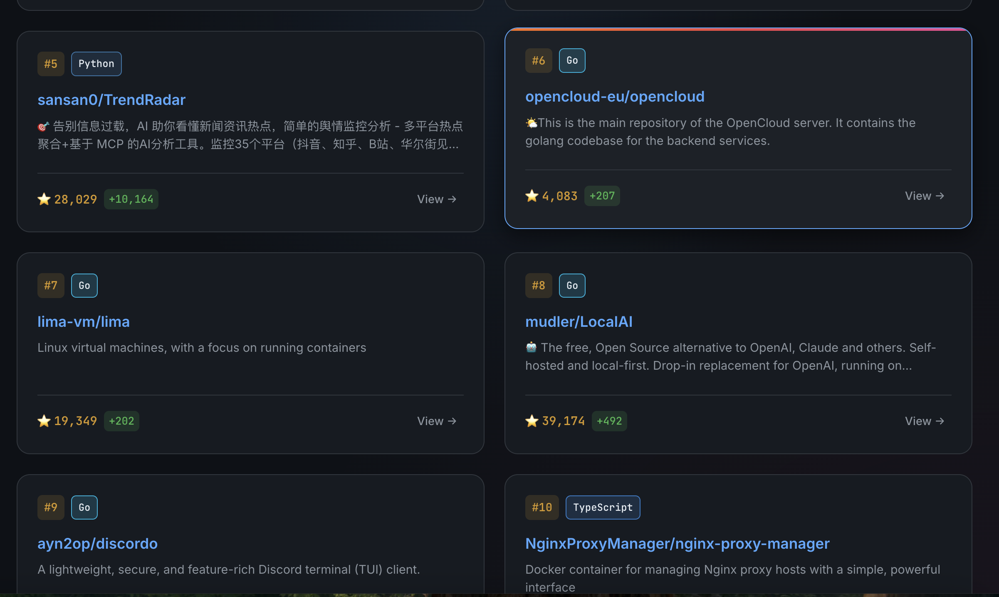

# 🔥 GitHub Trending

[English](#english) | [中文](#中文)

A simple and beautiful tool to fetch and display GitHub trending repositories.

一个简洁美观的工具，用于抓取和展示GitHub热门仓库。


---

## English

### ✨ Features

- 🖥️ **CLI Tool** - View trending repos directly in your terminal with colorful output
- 🌐 **Web Interface** - Beautiful local web page to browse trending repositories
- 🎨 **Cross-platform** - Works on Windows, macOS, and Linux
- 📅 **Time Range** - Support for daily, weekly, and monthly trending
- 🚀 **Fast & Simple** - No API token required, just run and go

### 📦 Installation

#### 1. Clone the repository

```bash
git clone https://github.com/cookiesen77-rgb/github-trending.git
cd github-trending
```

#### 2. Install dependencies

**macOS / Linux:**
```bash
pip3 install -r requirements.txt
```

**Windows:**
```bash
pip install -r requirements.txt
```

### 🚀 Quick Start

#### One-Click Web Launch

**macOS / Linux:**
```bash
./start_web.sh
```

**Windows:**
```bash
start_web.bat
```

Then visit `http://localhost:8080` in your browser.

#### CLI Mode (Terminal)

```bash
# Today's trending (default)
python github_trend.py

# This week's trending
python github_trend.py weekly

# This month's trending
python github_trend.py monthly

# Show help
python github_trend.py --help
```

#### Web Mode (Browser)

```bash
# Start the web server (auto-opens browser)
python web_server.py

# Specify a different port
python web_server.py --port 8080

# Don't open browser automatically
python web_server.py --no-browser
```

Then visit `http://localhost:8080` in your browser.

### 📸 Screenshots

#### CLI Output


Modern terminal display with:
- 🎨 Colorful output
- 📊 Repository statistics
- 🔗 Direct links to repositories
- 📅 Time range indicators

#### Web Interface

**Today's Trending:**


**Weekly Trending:**


**Monthly Trending:**


Modern dark theme with:
- 🎯 Card-based layout
- ⚡ Smooth animations
- 📱 Responsive design
- 🔄 Tab switching for time ranges

### 🤝 Contributing

Contributions are welcome! Feel free to:
- Report bugs
- Suggest new features
- Submit pull requests

### 📄 License

This project is licensed under the MIT License - see the [LICENSE](LICENSE) file for details.

---

## 中文

### ✨ 功能特点

- 🖥️ **命令行工具** - 在终端中直接查看热门仓库，彩色输出
- 🌐 **网页界面** - 美观的本地网页浏览热门仓库
- 🎨 **跨平台支持** - 支持 Windows、macOS 和 Linux
- 📅 **时间范围** - 支持今日、本周、本月热门
- 🚀 **快速简单** - 无需 API Token，开箱即用

### 📦 安装

#### 1. 克隆仓库

```bash
git clone https://github.com/cookiesen77-rgb/github-trending.git
cd github-trending
```

#### 2. 安装依赖

**macOS / Linux:**
```bash
pip3 install -r requirements.txt
```

**Windows:**
```bash
pip install -r requirements.txt
```

### 🚀 快速启动

#### 一键启动Web版

**macOS / Linux:**
```bash
./start_web.sh
```

**Windows:**
```bash
start_web.bat
```

然后在浏览器中访问 `http://localhost:8080`。

### 🚀 使用方法

#### 命令行模式

```bash
# 查看今日热门（默认）
python github_trend.py

# 查看本周热门
python github_trend.py weekly

# 查看本月热门
python github_trend.py monthly

# 显示帮助
python github_trend.py --help
```

#### 网页模式

```bash
# 启动Web服务器（自动打开浏览器）
python web_server.py

# 指定端口
python web_server.py --port 8080

# 不自动打开浏览器
python web_server.py --no-browser
```

然后在浏览器中访问 `http://localhost:8080`。

### 📸 截图

#### 命令行输出


现代终端显示，包含：
- 🎨 彩色输出
- 📊 仓库统计信息
- 🔗 直接链接到仓库
- 📅 时间范围指示

#### 网页界面

**今日热门：**


**本周热门：**


**本月热门：**


现代暗色主题，包含：
- 🎯 卡片式布局
- ⚡ 流畅动画
- 📱 响应式设计
- 🔄 标签切换时间范围

### 🤝 贡献

欢迎贡献！你可以：
- 报告 Bug
- 建议新功能
- 提交 Pull Request

### 📄 许可证

本项目采用 MIT 许可证 - 详见 [LICENSE](LICENSE) 文件。

---

Made with ❤️ for the open source community
